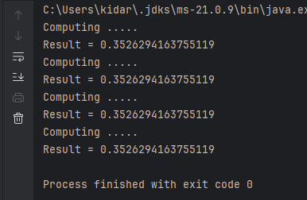
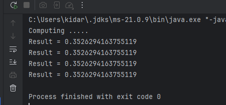
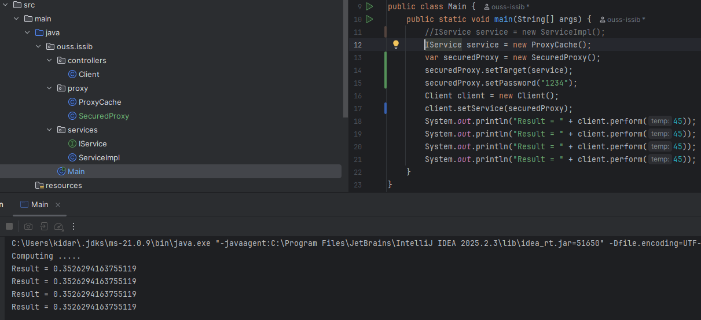
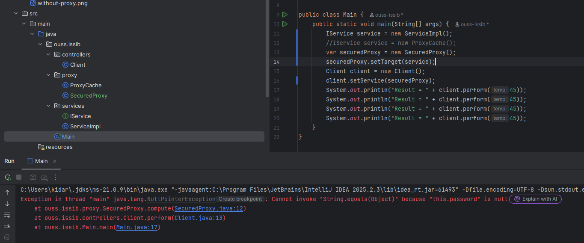
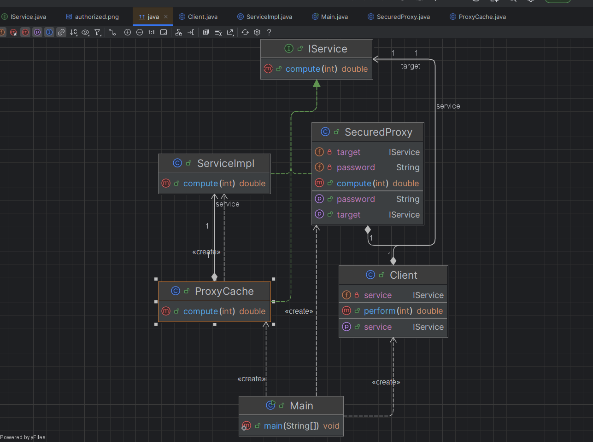

# 🧩 Activité Pratique – Implémentation du Design Pattern **Proxy** en Java

Ce dépôt présente une implémentation pratique du **Design Pattern Proxy** en Java. Cette activité fait partie du cours de **Design Patterns** encadré par **Mr YOUSSFI Mohamed**.

## 📘 Aperçu du projet

### Design Pattern Proxy
- **Objectif** : Illustrer l’utilisation du pattern **Proxy**, qui fournit un substitut ou un intermédiaire pour contrôler l’accès à un autre objet, permettant notamment la gestion de la sécurité via un mot de passe, le contrôle d’accès, et l’amélioration des performances tout en conservant l’interface originale de l’objet.
- **Technologies utilisées** :
  - `Java` (Programmation Orientée Objet)
  - Compatible avec tout IDE Java

## 🧱 Structure du projet

### 📦 Package `controllers`
Contient les classes clientes utilisant les services via le proxy :

- `Client` → classe cliente qui utilise les services à travers le proxy.

---

### 📦 Package `proxy`
Contient les classes proxy qui contrôlent l’accès aux services :

- `ProxyCache` → proxy implémentant un cache pour optimiser les appels.  
- `SecuredProxy` → proxy sécurisé demandant un mot de passe (`"1234"`).  
  - Lance une exception `NotAuthorizedException` si le mot de passe est incorrect ou non initialisé.

---

### 📦 Package `services`
Contient l’interface du service et son implémentation concrète :

- `IService` → interface avec une méthode `double compute(int t)`.  
- `ServiceImpl` → implémentation concrète de `IService`.

---

## ⚙️ Fonctionnalités principales
1. Utilisation du proxy pour contrôler l’accès aux services.  
2. Proxy sécurisé par mot de passe avec gestion d’exception.  
3. Proxy avec cache pour optimiser les performances.  
4. Respect du principe Open/Closed (OCP).

---

## 🧩 Captures d’écran
| Sans proxy (without-proxy.png) | Avec proxy (with-proxy.png) |
|-------------------------------|-----------------------------|
|  |  |

| Autorisé (authorized.png) | Non autorisé (not-authorized.png) |
|---------------------------|----------------------------------|
|  |  |

| Diagramme de Classe |
|---------------------------|
|  |
---

## 🚀 Comment Exécuter
```bash
git clone https://github.com/ouss-issib/design-pattern-proxy-java.git
cd design-pattern-proxy-java
mvn clean install
mvn javafx:run
